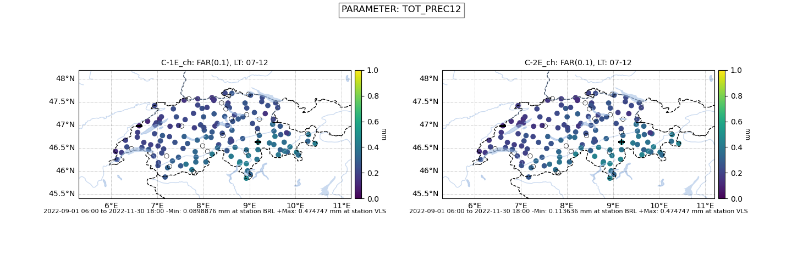
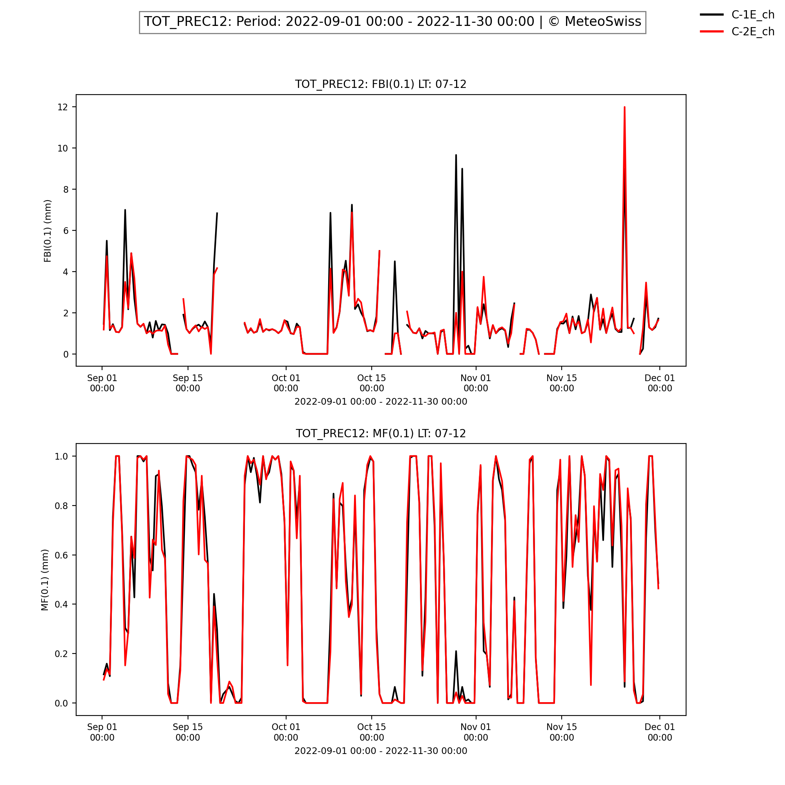
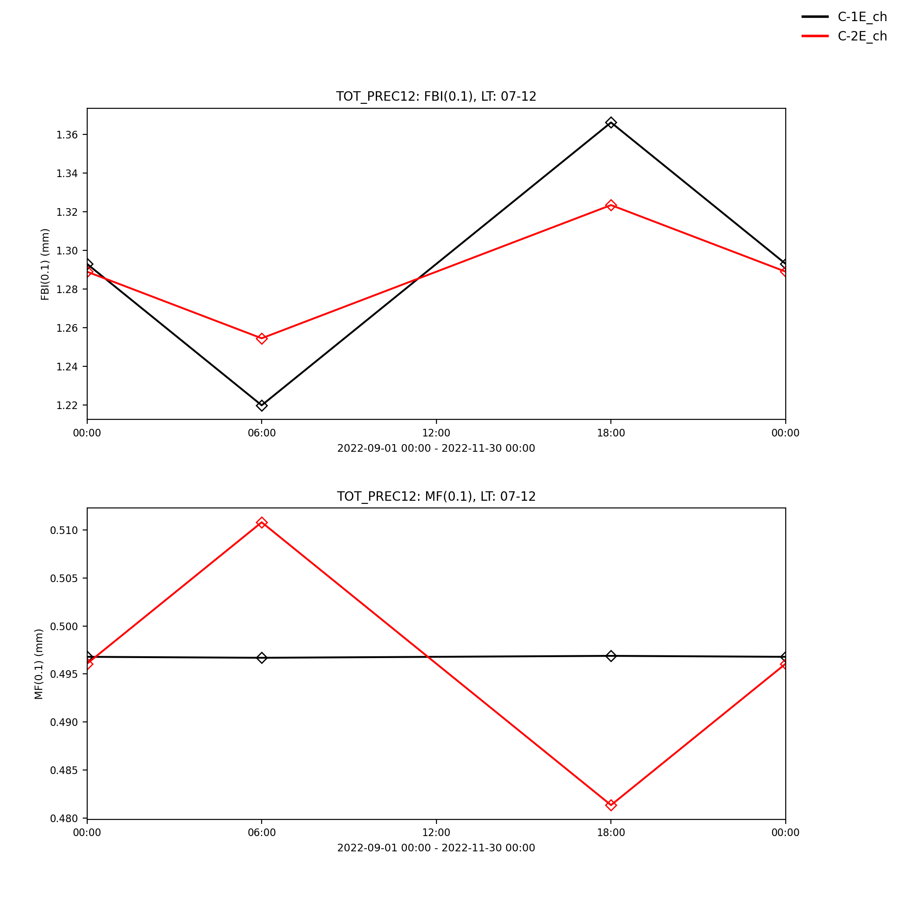
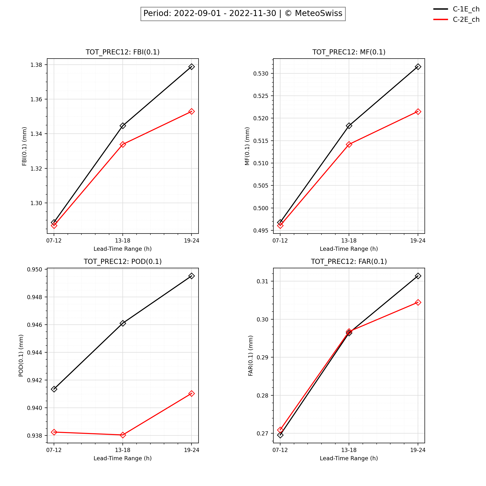
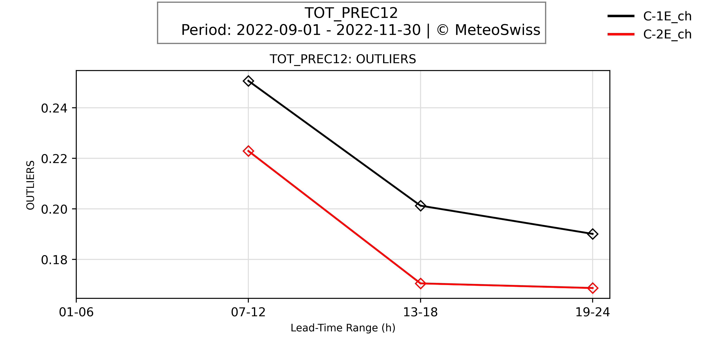
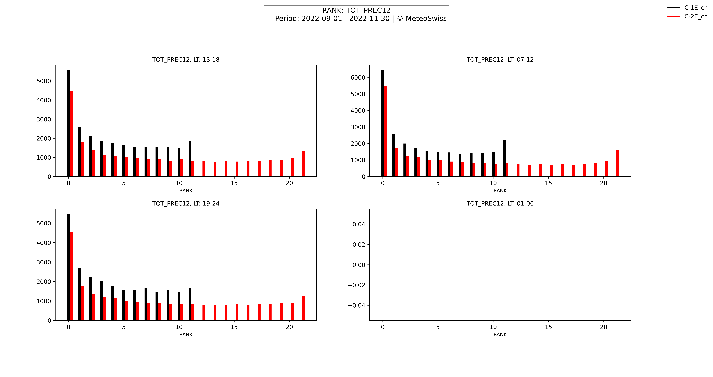
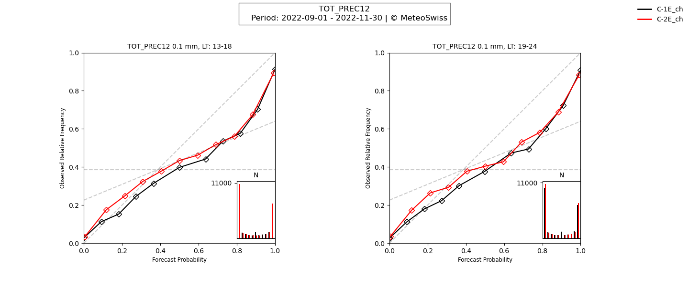

# MOVEROPlOT
Moveroplot is a Python-based tool to visualize/post-process verification results.
## Getting Started
To setup the project, follow the instructions in [CONTRIBUTING.md](CONTRIBUTING.md).


## Usage
The primary command for moveroplot follows the structure
```bash
moveroplot [OPTIONS] MODEL_VERSION(S)
moveroplot [OPTIONS] MODEL_VERSION(S)
```
To see the available options, run:
```bash
moveroplot -h
```
```
The following options are listed below:
Options:
  --plot_type TEXT            Specify the type of plot to generate: [total,
                              time, station, daytime, ensemble].
  --debug                     Add debug comments to command prompt.
  --lt_ranges TEXT            Specify the lead time ranges of interest. Def:
                              19-24
  --plot_params TEXT          Specify parameters to plot.
  --plot_scores TEXT          Specify scores to plot.
  --plot_cat_params TEXT      Specify categorical parameters to plot.
  --plot_cat_thresh TEXT      Specify categorical scores thresholds to plot.
  --plot_cat_scores TEXT      Specify categorical scores to plot.
  --plot_ens_params TEXT      Specify parameters to ensemble plots.
  --plot_ens_scores TEXT      Specify scores to ensemble plots.
  --plot_ens_cat_params TEXT  Specify categorical parameters to ensemble
                              plots.
  --plot_ens_cat_scores TEXT  Specify categorical scores to ensemble plots.
  --plot_ens_cat_thresh TEXT  Specify categorical scores thresholds to
                              ensemble plots.
  --input_dir PATH            Specify input directory.
  --output_dir TEXT           Specify output directory. Def: plots
  --colors TEXT               Specify the plot color for each model version
                              using matploblib's color coding
  --relief                    Add relief to maps.
  --grid                      Add grid to plots.
  -V, --version               Show the version and exit.
  -v, --verbose               Increase verbosity; specify multiple times for
                              more.
  -h, --help                  Show this message and exit.

```
`moveroplot` efficiently processes user inputs to construct a `plot_setup` dictionary, which is pivotal in organizing the plotting process.
This dictionary is structured with two primary keys: 'model_versions' and 'parameter'.
* 'model_versions': This key maps to a list encompassing the model versions to plot.
* 'parameter': This key connects to a nested dictionary. Within this nested structure, each parameter serves as a key linked to its corresponding scores to plot.

To offer a clearer understanding, the image below illustrates the potential parameters and their associated scores and their thresholds:


In the subsequent stages, `plot_setup` is channeled into distinct plotting pipelines. There, the source files are retrieved, parsed and plotted.
Ultimately, all plots are saved in the `<output_dir>/` directory as PNG files.

### Usage Examples
Example Command plotting Station, Time, Total and Daytime Scores:
```
moveroplot C-1E_ch/C-2E_ch --lt_ranges 07-12,19-24,61-72 --input_dir /scratch/osm/movero/wd/2022s4 --plot_type station,time,daytime,total
--plot_cat_params TOT_PREC12,TOT_PREC6,CLCT,T_2M,TD_2M,FF_10M,VMAX_10M6
--plot_cat_thresh 0.1,1,10:0.2,1,5:0.2,0.5,2:2.5,6.5:0,15,25:0,15,25:-5,5,15:-5,5,15:2.5,5,10:2.5,5,10:5,12.5,20:5,12.5,20
--plot_cat_scores FBI,MF/OF,POD,FAR,THS,ETS
--plot_params TOT_PREC12,TOT_PREC6,TOT_PREC1,CLCT,GLOB,DURSUN12,DURSUN1,T_2M,T_2M_KAL,TD_2M,TD_2M_KAL,RELHUM_2M,FF_10M,FF_10M_KAL,VMAX_10M6,VMAX_10M1,DD_10M,PS,PMSL
--plot_scores ME,MMOD/MOBS,MAE,STDE,RMSE,COR,NOBS
```
Example Command plotting Ensemble Scores:
```
moveroplot C-1E_ch/C-2E_ch --lt_ranges 07-12,19-24,61-72 --input_dir /scratch/osm/movero/wd/2022s4 --plot_type ensemble
--plot_ens_params TOT_PREC12,TOT_PREC6,CLCT,T_2M,TD_2M,FF_10M,VMAX_10M6
--plot_ens_scores OUTLIERS,RANK,RPS,RPS_REF
--plot_ens_cat_params TOT_PREC12,TOT_PREC6,CLCT,T_2M,TD_2M,FF_10M,VMAX_10M6
--plot_ens_cat_thresh 0.1,0.2,2.5,0,0,2.5,5
--plot_ens_cat_scores REL,RES,BS,BS_REF,BSS,BSSD,REL_DIA
```

## Plotting Pipeline and Output
### Plotting Multiple Model Versions

### Spatial Verification
> Relevant File: [station_scores.py](src/moveroplot/station_scores.py)

### Time Series of Verification Scores
> Relevant File: [time_scores.py](src/moveroplot/time_scores.py)

### Diurnal Cycle of Verification Scores
> Relevant File: [daytime_scores.py](src/moveroplot/daytime_scores.py)

### Total scores for all lead times
> Relevant File: [total_scores.py](src/moveroplot/total_scores.py)
>
> Remark: how are scores assigned to subplots?
>
> die Reihenfolge in --plot_scores ist entscheidend. Es kommen immer 4 plots auf eine Seite für die normalen Scores. Die --plot_cat_scores beginnen auf jeden Fall auf einer neuen Seite, und jeder Threshold beginnt wieder auf einer neuen Seite.


### Ensemble scores
> Relevant File: [ensemble_scores.py](src/moveroplot/ensemble_scores.py)
#### Regular Plots

#### RANK

#### Reliability Diagram

